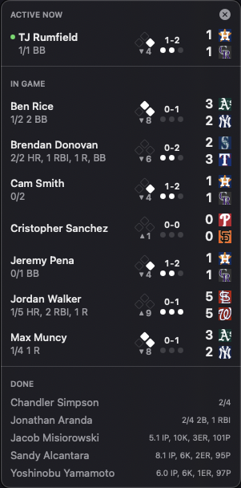

<h1 align="center">
  
   
  On Deck
</h1>

A macOS menu bar app that monitors live MLB games and sends notifications when your fantasy baseball players (from [Fantrax](https://www.fantrax.com)) are batting or pitching.

  

## Features

- **Live game tracking** - Monitors active MLB games via incremental diffPatch updates (every 10s), falling back to full fetches only during game phase transitions
- **At-bat notifications** - Get alerted when your player steps up to bat or takes the mound; notifications auto-dismiss when the at-bat ends or on click
- **Result notifications** - See at-bat and pitching results as they happen
- **Menu bar scoreboard** - Live scores, count, bases, outs, and inning for each player's game
- **Stat lines** - Batting and pitching lines update in real time
- **Floating panel** - Pin the player list as an always-on-top window
- **Stream links** - Click a player row to jump straight to the game stream
- **Lineup status** - Shows batting order position and notifies you pre-game if an active fantasy hitter isn't in the MLB lineup, with checks at 2h/1h/30m before first pitch
- **Wake recovery** - Refreshes live data after system sleep or screen unlock so you don't miss anything
- **Bench filtering** - Option to hide bench players from the roster
- **Daily auto-refresh** - Roster and schedule re-sync every morning

## Setup

1. Open `onDeck.xcodeproj` in Xcode
2. Build and run (Cmd+R)
3. Click the menu bar icon and open **Settings**
4. Paste your Fantrax league URL and select your team

## Requirements

- macOS 26+
- Xcode 26+
- No third-party dependencies

## Tech Stack

- Swift 6 / SwiftUI
- MenuBarExtra for the menu bar interface
- `@Observable` + Swift concurrency
- MLB Stats API (incremental diffPatch polling)
- Fantrax API for roster data
- UserNotifications for alerts
